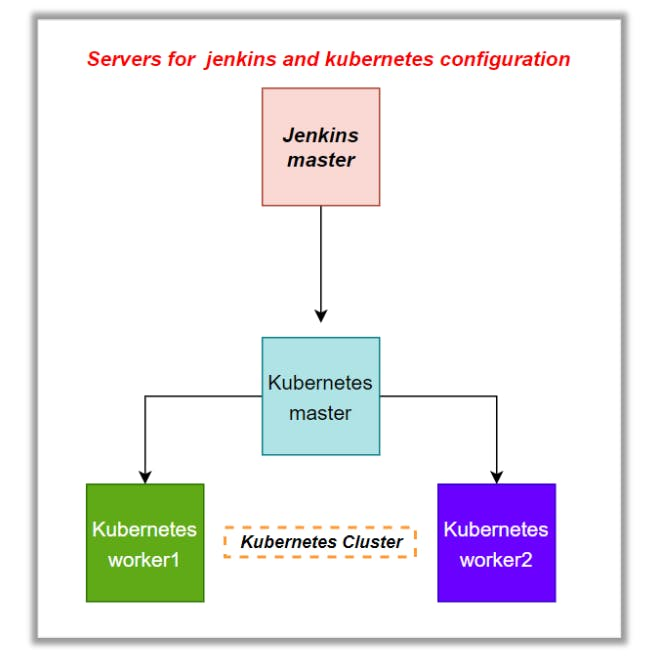
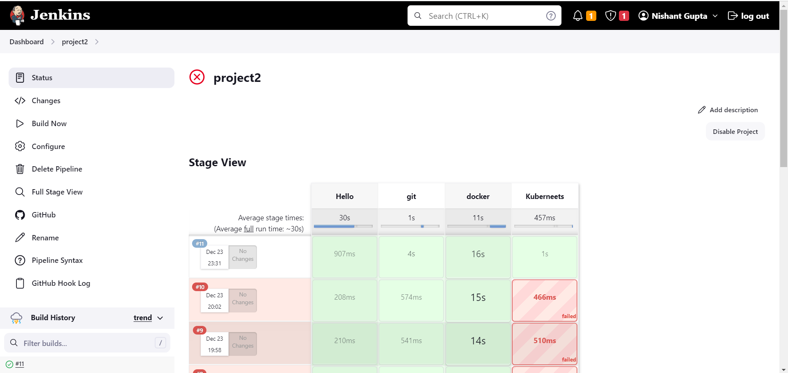

Name: Nishant Gupta

Email: <ngofficial99@gmail.com>

LinkedIn: https://www.linkedin.com/in/nishant-gupta-878a25280/

You are hired as a DevOps engineer for Analytics Pvt Ltd. This company
is a product based organization which uses Docker for their
containerization needs within the company. The final product received a
lot of traction in the first few weeks of launch. Now with the
increasing demand, the organization needs to have a platform for
automating deployment, scaling, and operations of application containers
across clusters of hosts, As a DevOps engineer, you need implement a
DevOps life cycle, such that all the requirements are implemented
without any change in the Docker containers in the testing environment.

Up until now, this organization used to follow a monolithic architecture
with just 2 developers. The product is present on
https://github.com/NishantGupta99/Jenkins-capstone-repo

Following are the specifications of life-cycle:

1.  Git workflow should be implemented. Since the company follows
    monolithic architecture of Development you need to take care of
    version control. The release should happen only on 25th of every
    month.

2.  Code build should be triggered once the commits are made in the
    master Branch.

3.  The code should be containerized with the help of the Docker file,
    The Dockerfile should be built every time if there is a push to
    Git-Hub. Create a custom Docker image using a Dockerfile.

4.  As per the requirement in the production server, you need to use the
    Kubernetes cluster and the containerized code from Docker hub should
    be deployed with 2 replicas. Create a NodePort service and configure
    the same for port 30008.

5.  Create a Jenkins pipeline script to accomplish the above task.

6.  For configuration management of the infrastructure, you need to
    deploy the configuration on the servers to install necessary
    software and configurations.

7.  Using Terraform accomplish the task of infrastructure creation in
    the AWS cloud provider.

Architectural Advice Software's to be installed on the respective
machines using configuration management.

-   Worker1: Jenkins, Java.

-   Worker2: Docker, Kubernetes.

-   Worker3: Java, Docker, Kubernetes

-   Worker4: Docker, Kubernetes.\
    
    

Solution:

-   We will create a Ec2 instance which will act as the Controller
    instance.

-   Login to AWS and create a Ubuntu instance.

-   Create and logon to this instance inside this we will be installing
    terraform.

-   Run the following command to create a Terraform script file.

sudo su

apt-get update -y

#Now we will install terraform create the terra_install bash file and
run it

vi terra_install.sh

-   Add the following script.

sudo apt-get update && sudo apt-get install -y gnupg
software-properties-common

wget -O- https://apt.releases.hashicorp.com/gpg \| \\

gpg \--dearmor \| \\

sudo tee /usr/share/keyrings/hashicorp-archive-keyring.gpg

gpg \--no-default-keyring \\

\--keyring /usr/share/keyrings/hashicorp-archive-keyring.gpg \\

\--fingerprint

echo \"deb
\[signed-by=/usr/share/keyrings/hashicorp-archive-keyring.gpg\] \\

https://apt.releases.hashicorp.com \$(lsb_release -cs) main\" \| \\

sudo tee /etc/apt/sources.list.d/hashicorp.list

sudo apt update -y

sudo apt-get install terraform -y

-   We will run this file to install terraform.

-   Let\'s wait for this to install.

-   Now we will write a tf file to generate the ec2 machines for our k8s
    master and slaves.

    -   Sudo nano main.tf

terraform {

required_providers {

aws = {

source = \"hashicorp/aws\"

}

}

}

provider \"aws\" {

region = \"ap-south-1\"

}

resource \"aws_instance\" \"example\" {

ami = \"ami-03f4878755434977f\"

count = 2

instance_type = \"t2.medium\"

key_name = \"Nishant-mumbai-kp\"

tags = {

Name = \"kub-slave-\${count.index}\"

}

}

resource \"aws_instance\" \"main\" {

ami = \"ami-03f4878755434977f\"

count = 1

instance_type = \"t2.medium\"

key_name = \"Nishant-mumbai-kp\"

tags = {

Name = \"kub1-master\"

}

}

-   We will attach a role to the controller ec2 instance with the
    permission of power user.

-   Now we can run the main.tf file by running these commands.

> terraform init
>
> terraform validate
>
> terraform plan
>
> terraform apply

-   Our instances have been created.

-   Now we will be installing kubernetes in the master and the slave
    instances.

-   Connect to all 3 instances.

-   We will make the kubectl installation in the all the clusters create
    a file called kube_install.sh

-   Add the following script.

\## Install Docker

sudo apt-get update

sudo wget
https://raw.githubusercontent.com/lerndevops/labs/master/scripts/installDocker.sh
-P /tmp

sudo chmod 755 /tmp/installDocker.sh

sudo bash /tmp/installDocker.sh

sudo systemctl restart docker.service

\## Install CRI-Docker

sudo wget
https://raw.githubusercontent.com/lerndevops/labs/master/scripts/installCRIDockerd.sh
-P /tmp

sudo chmod 755 /tmp/installCRIDockerd.sh

sudo bash /tmp/installCRIDockerd.sh

sudo systemctl restart cri-docker.service

\## Install kubeadm,kubelet,kubectl

sudo wget
https://raw.githubusercontent.com/lerndevops/labs/master/scripts/installK8S.sh
-P /tmp

sudo chmod 755 /tmp/installK8S.sh

sudo bash /tmp/installK8S.sh

\# Validate

docker -v

cri-dockerd \--version

kubeadm version -o short

kubelet \--version

kubectl version \--client

-   Run the sh file by running in all the nodes.

    -   Sudo bash kube_install.sh

-   Now we will go inside the master node and initialise the kubernetes
    master node.

-   Run the following commands inside the master node.

\## Initialize kubernetes Master Node

sudo kubeadm init \--cri-socket unix:///var/run/cri-dockerd.sock
\--ignore-preflight-errors=all

sudo mkdir -p \$HOME/.kube

sudo cp -i /etc/kubernetes/admin.conf \$HOME/.kube/config

sudo chown \$(id -u):\$(id -g) \$HOME/.kube/config

-   Now we need to install the network driver Calico.

\## below installs calico networking driver

kubectl apply -f
https://raw.githubusercontent.com/projectcalico/calico/v3.24.1/manifests/calico.yaml

\# Validate: kubectl get nodes

-   Now to connect the slave nodes to the master node we will generate
    the token.

-   To generate the token we will run the following command.

    -   kubeadm token create \--print-join-command

-   Now we will go to the slave nodes and run this token, so copy this
    token and open the slave nodes.

-   Do the same on the second node.

-   We can verify that the cluster is set by running kubectl get nodes
    command in the master branch.

-   Now we need to install Jenkins in the controller.

-   Run the following commands in the controller to install jenkins.

sudo apt-get install openjdk-11-jdk -y

curl -fsSL https://pkg.jenkins.io/debian-stable/jenkins.io-2023.key \|
sudo tee \\

/usr/share/keyrings/jenkins-keyring.asc \> /dev/null

echo deb \[signed-by=/usr/share/keyrings/jenkins-keyring.asc\] \\

https://pkg.jenkins.io/debian-stable binary/ \| sudo tee \\

/etc/apt/sources.list.d/jenkins.list \> /dev/null

sudo apt-get update

sudo apt-get install jenkins -y

-   After Jenkins is installed we will open Jenkins using the public
    port.

-   Setup Jenkins

-   Install the suggested plugins.

-   Before we proceed ahead make sure that your Gitwork flow is ready
    with the Dockerfile is ready.

-   And the docker file will be as follows.

-   Now We will create a pipeline project.

-   Select the project type as a github project and add the repository
    link.

-   In build triggers we need to specify build periodically for 25th day
    of every month

-   We will also select GithubSCM polling.

-   In the pipeline script we will add the following script.

pipeline{

agent none

environment {

DOCKERHUB_CREDENTIALS=credentials(\'DOCKERHUB_CREDENTIALS\')

}

stages{

stage(\'Hello\'){

agent{

label \'Kub-master\'

}

steps{

echo \'Hello World\'

}

}

stage(\'git\'){

agent{

label \'Kub-master\'

}

steps{

git \'https://github.com/NishantGupta99/Jenkins-capstone-repo\'

}

}

stage(\'docker\') {

agent {

label \'Kub-master\'

}

steps {

sh \'sudo docker build /home/ubuntu/jenkins/workspace/project2 -t
ngofficial99/demo1\'

sh \'sudo echo \$DOCKERHUB_CREDENTIALS_PSW \| sudo docker login -u
\$DOCKERHUB_CREDENTIALS_USR \--password-stdin\'

sh \'sudo docker push ngofficial99/demo1\'

}

}

stage(\'Kuberneets\') {

agent {

label \'Kub-master\'

}

steps {

sh \'kubectl apply -f deploy.yml\'

sh \'kubectl apply -f svc.yml\'

}

}

}

}

-   Save and exit.

-   Setup the dockerhub credentials in the global credentials.

-   Now before we proceed we need to add the Kube-master as a jenkins
    node.

-   Go to manage jenkins and then nodes.

-   Click on New node.

-   Select permanent agent and click on create.

-   Add the host and the credentials pem file

-   Click on save.

-   Once the node has been added we will try to start the build.

-   Now we can go to the public IP of the Kubernetes cluster and the
    post 30008 to see the web page.

-   Finally we need to set the webhook so the build can take place every
    time there is a commit.

-   Go to the github repository and the repository settings.

-   Click on add webhooks

-   Create a jenkins user api token

-   Configure the webhook.

-   Webhook has been finally done.

We have successfully completed the entire infrastructure.
